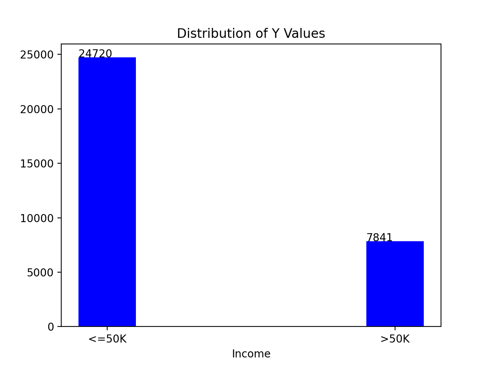
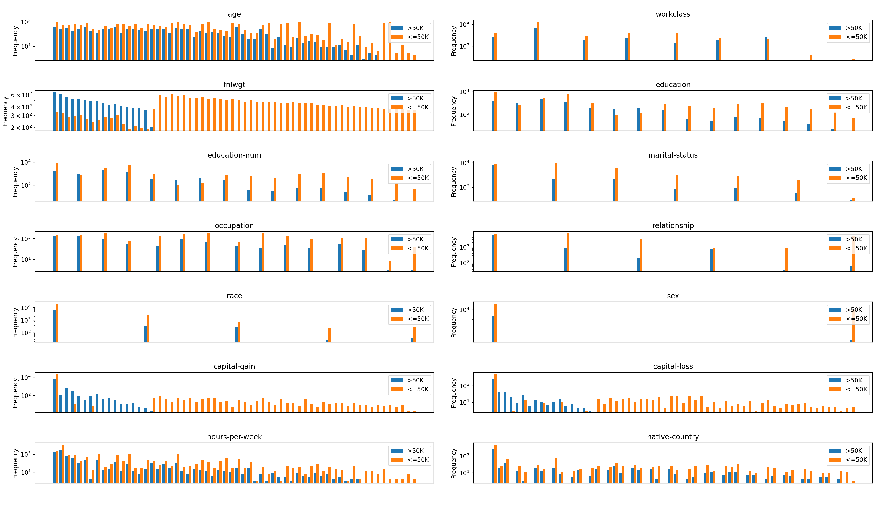

# Income Classification Based on Census Data using Decision Trees
By Saskia Gilmer 

## Model Details
Model Date: October 15, 2021

Model version: 0

Model type: Decision Tree Binary Classifier. The model is built upon scikit-learn's DecisionTreeClassifier. More information about the training algorithm and parameters used can be found in their documentation: https://scikit-learn.org/stable/modules/tree.html#classification

Questions about the model can be sent to saskia.gilmer@mail.mcgill.ca

## Intended Use
The model's goal is to correctly predict whether an individual in the U.S.A census data will made over 50,000 USD that year. These predictions are intended to be used as a tool to study machine learning pipeline development. 

The primary intended users are people seeking to learn about binary classification. To use the model, run predict.py and respond to the prompts. 

This model predictions may be influenced by gender and racial bias, so is not suited for use in industry. Examples of out of scope use cases include using the model to project the future income of an individual based on their demographic, or using the model's prediction to determine whether individuals should be approved for a loan. The model is also not intended to predict whether people will make above 50,000 USD in 2021, since the dataset is from 27 years ago. 

## Factors
Some groups are more commonly represented in the dataset. For example, there are many more training examples in which the race of the individual is white (over 20,000 examples) than training examples in which race is Amer-Indian-Eskimo (311 examples). It has been shown that classifier performance generally improves as the number of training examples increases. Therefore, the model may perform less well for minority groups than majority groups. However, more investigation is needed.

## Metrics
We report error in order to compare with original results found by Ronny Kohavi and Barry Becker (accesible under Data Set Description at https://archive.ics.uci.edu/ml/datasets/adult). 
        
We also report F1 score, which is a measure of accuracy, since the class distribution is imbalanced. 

All metric values are averages found via 10-fold cross validation. 
        
## Training and Evaluation Data
### Dataset
The dataset used for training and evaluation consists a portion of the 1994 USA Census database. The dataset is downloaded from https://archive.ics.uci.edu/ml/datasets/adult. It is then renamed from adult.data to adult.csv in order to support dataset exploration via JupyterLab Spreadsheet Editor. There are 48842 training examples in the extracted portion. About 75% of data points have the label <=50K, and about 25% have the >50K label, as shown below.

There are 14 features in the dataset. Their distribuitions are shown below. For readability, the histograms are displayed using a logarithmic scale. 

### Preprocessing
First, we remove any rows with missing values for the remaining features or the target. 

Next, since the scikit-learn decision tree model uses continuous numeric features, we must convert all data that uses categorical labels to its equivalent one-hot encoding.

Then, we perform tree-based feature selection using the model.

The final version of the dataset that we use for training and testing has up to 15 features, does not contain missing values, and contains only numerical values.

For evaluation, we use stratified K-fold cross validation, in which 90% of the examples in the dataset are used for training and 10% are used for testing. For the final production model, 100% of the dataset is used for training.

## Quantitative Analyses
This model's error is **18.43**. For comparison, the lowest error that Kohavi and Becker found was achieved by the NBTree algorithm, and was 14.10.

The model's F1 score is **88.16**. 